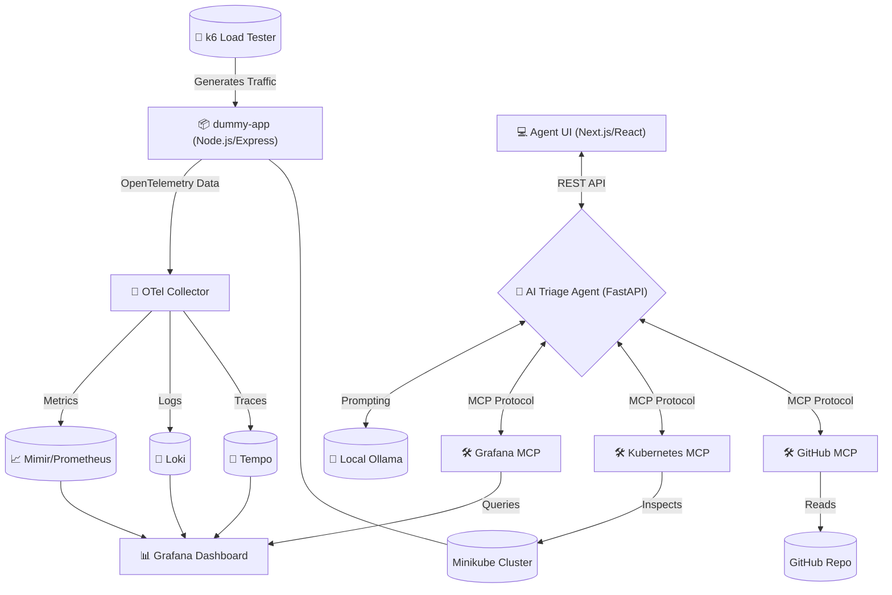

# AI Triage Agent 🕵️‍♂️🩺

This project features an AI-driven triage agent designed to automatically diagnose and troubleshoot application errors in a microservices environment. It leverages the **Model Context Protocol (MCP)** to interact directly with observability dashboards, infrastructure control planes, and source control.

At its core, the project provides a fully instrumented, locally deployable ecosystem—complete with an application, telemetry stack, load generation, and the AI agent itself.

## 🏗️ Architecture & Components



The repository is structured into the following key components:

### 1. The Application (`dummy-app/`)
A simple Node.js application built with Express and TypeScript. It is intentionally designed to simulate various error conditions (e.g., 500 Internal Server Errors, high latency) and is heavily instrumented with **OpenTelemetry** to export metrics and traces.

### 2. The Observability Stack (`lgtm/`)
A complete dockerized **LGTM Stack** (Loki, Grafana, Tempo, Mimir/Prometheus) combined with an OpenTelemetry Collector. This stack receives telemetry data from the `dummy-app`, stores it, and makes it visualizable and queryable via Grafana.

### 3. Load Generation (`k6/`)
A **k6 load testing suite** written in TypeScript. It bombards the `dummy-app` with traffic to generate a steady stream of healthy requests and, crucially, errors and slow responses that the observability stack records and the AI agent triages.

### 4. Model Context Protocol Tools (`mcp/`)
The toolbelt for the AI Agent. This directory contains configurations and Dockerfiles to run three specialized MCP servers:
*   **Grafana MCP:** Allows the AI to query metrics (Mimir/Prometheus) and logs (Loki) to detect anomalies.
*   **Kubernetes MCP:** Allows the AI to inspect Pods, check container logs, and view cluster state.
*   **GitHub MCP:** Allows the AI to inspect commits, PRs, and repository history to find the code changes that caused an issue.

### 5. The AI Agent (`agent/`)
The "Brain" of the operation. This is a **FastAPI** Python application built with **uv** and **LangGraph/LangChain**. It uses a local **Ollama** LLM (e.g., `qwen3.5:9b`) as its reasoning engine. The agent serves a REST API (`/triage`) and is configured to autonomously connect to the MCP servers, evaluate alerts, and determine the root cause of application failures proactively.

### 6. The User Interface (`agent-ui/`)
A premium, dark-mode chat interface built with **Next.js**, **React**, and **Material UI**. It connects to the AI Agent's REST API, providing SREs with a natural language interface to query cluster state, view logs, and troubleshoot incidents.

## � Requirements

Before proceeding, ensure you have the following installed on your host machine:

### Infrastructure
*   **Docker:** Required for building container images.
*   **Minikube:** The local Kubernetes orchestrator.
*   **kubectl:** The CLI tool for interacting with the Minikube cluster.

### AI & Agents
*   **Ollama:** Must be installed and running locally to serve the LLM.
*   **uv:** Fast Python package manager (required if you wish to run the agent outside of Docker for development).

### Application (Optional for local dev)
*   **Node.js & npm:** Required to build the `dummy-app` locally before containerization.

---

## 🚀 Getting Started

You can run the entire ecosystem locally using the provided automation scripts.

### 0. Verify Requirements

Run the built-in requirements checker. It will scan your machine and provide exact commands to install any missing tools:
```bash
sh check-requirements.sh
```

### 1. Initial Setup

1.  **Start Ollama:** Run the provided script to start Ollama with the correct host binding (`0.0.0.0`) so the Kubernetes cluster can communicate with it:
    ```bash
    ./start-ollama.sh
    ```
2.  **Configure GitHub Token:**
    *   Create a file at `mcp/.env`.
    *   Add your GitHub Personal Access Token:
        ```bash
        GITHUB_PERSONAL_ACCESS_TOKEN=ghp_your_token_here
        ```

### 2. Cluster Run (Minikube)

To simulate a true production environment and give the Kubernetes MCP tool a real cluster to analyze, deploy everything to Minikube.

```bash
# Ensure minikube is started, then run:
./run-minikube.sh
```
*Note: This script will build the images, side-load them into minikube, apply all manifests across the different components, and initiate port-forwarding.*

### 3. Generate Traffic & Errors

Once the cluster is running, you need to simulate user activity (and errors) for the AI to analyze. Open a new terminal window and run:
```bash
./run-traffic.sh
```
*Note: You can leave this running in the background. It sends a mix of 200 OKs, 500 Errors, and slow responses to the Node.js application.*

---

## 🚪 Accessing the Services

Once the stack is running via Minikube, you can access the essential services at the following local ports:

*   **Agent Chat UI:** `http://localhost:3002` (After running `npm run dev` in `agent-ui/`)
*   **Agent REST API:** `http://localhost:8000/triage`
*   **Dummy App API:** `http://localhost:3000`
*   **Grafana Dashboard:** `http://localhost:3001` (u: `admin`, p: `admin`)

---

## 🛠️ Tech Stack Highlights
*   **Agent Backend:** FastAPI, Python 3.12, LangGraph, MCP SDK, `uv` Package Manager, local Ollama LLMs.
*   **Agent Frontend:** Next.js, React, Material UI, Framer Motion.
*   **App & Testing:** Node.js, TypeScript, Express, OpenTelemetry JS, Grafana k6.
*   **Observability:** Grafana, Loki (Logs), Tempo (Traces), Mimir/Prometheus (Metrics).
*   **Infrastructure:** Kubernetes, Minikube.
