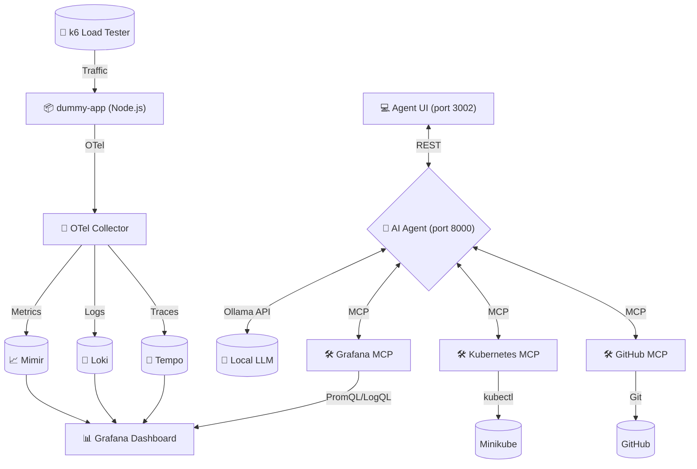

# AI Triage Agent 🕵️‍♂️🩺

This project features an AI-driven triage agent designed to automatically diagnose and troubleshoot application errors in a microservices environment. It leverages the **Model Context Protocol (MCP)** to interact directly with observability dashboards, infrastructure control planes, and source control.

At its core, the project provides a fully instrumented, locally deployable ecosystem—complete with an application, telemetry stack, load generation, and the AI agent itself.

## 🏗️ Architecture & Components



### 1. The AI Agent (`agent/`)
The "Brain" of the operation. built with **FastAPI**, **LangGraph**, and **Ollama**. Unlike standard chatbots, this agent implements an **Autonomous Multi-Turn Reasoning Loop** (up to 100 iterations) that allows it to:
*   Detect an anomaly via Grafana metrics.
*   Cross-reference with Loki logs.
*   Inspect Kubernetes pod state via `kubectl`.
*   Compare code changes via GitHub history.
*   Synthesize a root cause analysis independently.

### 2. The Agent UI (`agent-ui/`)
A premium chat interface built with **Next.js** and **Material UI**. It provides a real-time view of the agent's thought process as it executes its autonomous loop.

### 3. Model Context Protocol Tools (`mcp/`)
The agent's interface to the infrastructure.
*   **Grafana MCP:** Queries metrics and logs.
*   **Kubernetes MCP:** Inspects Pods, logs, and cluster events (standardized to `resourceType` parameters).
*   **GitHub MCP:** Tracks code regressions.

### 4. Instrumented Ecosystem
*   **`dummy-app/`**: A Node.js app designed to fail in specific patterns (latency, 500s).
*   **`lgtm/`**: Full observability stack (Loki, Grafana, Tempo, Mimir).
*   **`k6/`**: Automated load generator to trigger the agent's sensors.

---

## 🚀 Getting Started

### 1. Requirements
*   **Docker & Minikube**: Core container infrastructure.
*   **kubectl**: Kubernetes CLI.
*   **Ollama**: Running locally with enough VRAM (see Troubleshooting).
*   **uv**: Python package manager.

### 2. Setup
1.  **Configure GitHub**: Add `GITHUB_PERSONAL_ACCESS_TOKEN` to `mcp/.env`.
2.  **Start Ollama**: Use the host-bound script to allow cluster connectivity:
    ```bash
    ./start-ollama.sh
    ```
3.  **Deploy Everything**:
    ```bash
    ./run-minikube.sh
    ```
    *This script builds all images, sideloads them to Minikube, applies manifests, and starts port-forwarding.*

4.  **Simulate Traffic**:
    ```bash
    ./gen-traffic.sh
    ```

---

## 🚪 Verified Port Mapping

| Service | Host Port | In-Cluster Port | Description |
|---------|-----------|-----------------|-------------|
| **Agent UI** | `3002` | `3002` | The main chat interface. |
| **Agent API** | `8000` | `8000` | The backend REST API. |
| **Dummy App** | `3000` | `3000` | The target application. |
| **Grafana** | `3001` | `3001` | LGTM Dashboards (u/p: admin/admin). |
| **MCP Servers**| `8080-82` | `8080` | GitHub, K8s, and Grafana tools. |
| **OTLP** | `4317-18` | `4317-18` | Telemetry ingestion. |

---

## 🔧 Troubleshooting & Performance

### VRAM & Context Window
The agent is optimized for models like `qwen3.5:9b-q8_0`. 
*   **Context Window**: Configured to `16,384` in `llm.py` to handle deep investigation history.
*   **VRAM Usage**: The autonomous loop stores significant state; Ensure at least ~16GB VRAM (or use a smaller 4-bit quant) for smooth multi-turn reasoning.

### MCP Timeouts
Complex queries (like searching thousands of logs) may cause timeouts. We have standardized the `agent/mcp_client.py` to use a **5-minute timeout** and **1-hour SSE read timeout** to prevent premature failure.

### Tool Schemas
When using the Kubernetes tool, ensure the agent uses the `resourceType` parameter (e.g., `resourceType="pods"`) as opposed to plain `resource`, which is the standard required by our MCP implementation.
