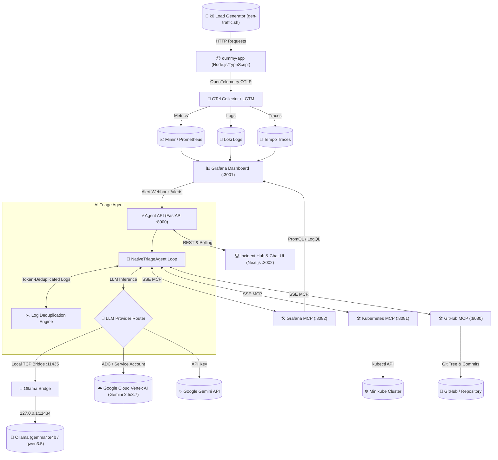

# AI Triage Agent 🕵️‍♂️🩺

An autonomous AI Site Reliability Engineering (SRE) diagnostic agent designed to automatically investigate, triage, and troubleshoot production incidents in a Kubernetes microservices ecosystem.

The agent leverages the **Model Context Protocol (MCP)** to interact directly with observability telemetry (Prometheus & Loki), infrastructure control planes (Kubernetes API), and source repositories (GitHub / local code). It correlates metrics, analyzes deduplicated error logs, inspects pods and deployment manifests, reviews source code, and synthesizes structured markdown SRE Diagnostic Reports.

---

## 🏗️ Architecture & Ecosystem


```mermaid
graph TD
    %% Traffic & Load Generation
    k6[("🚀 k6 Load Generator (gen-traffic.sh)")] -->|HTTP Requests| app["📦 dummy-app (Node.js/TypeScript)"]

    %% Observability Stack
    app -->|OpenTelemetry OTLP| otel["📡 OTel Collector / LGTM"]
    otel -->|Metrics| mimir[("📈 Mimir / Prometheus")]
    otel -->|Logs| loki[("📜 Loki Logs")]
    otel -->|Traces| tempo[("🔗 Tempo Traces")]
    mimir --> grafana["📊 Grafana Dashboard (:3001)"]
    loki --> grafana
    tempo --> grafana

    %% Alerting & Incident Trigger
    grafana -->|Alert Webhook /alerts| agent_api["⚡ Agent API (FastAPI :8000)"]

    %% AI Agent Core
    subgraph "AI Triage Agent"
        agent_api --> agent_loop["🧠 NativeTriageAgent Loop"]
        agent_loop <-->|Token-Deduplicated Logs| dedup["✂️ Log Deduplication Engine"]
        agent_loop <-->|LLM Inference| llm_router{"🤖 LLM Provider Router"}
    end

    %% LLM Providers
    llm_router -->|Local TCP Bridge :11435| bridge["🌉 Ollama Bridge"]
    bridge -->|127.0.0.1:11434| ollama[("🦙 Ollama (gemma4:e4b / qwen3.5)")]
    llm_router -->|ADC / Service Account| vertex[("☁️ Google Cloud Vertex AI (Gemini 2.5/3.7)")]
    llm_router -->|API Key| gemini[("✨ Google Gemini API")]

    %% MCP Tool Servers
    agent_loop <-->|SSE MCP| mcp_grafana["🛠️ Grafana MCP (:8082)"]
    agent_loop <-->|SSE MCP| mcp_k8s["🛠️ Kubernetes MCP (:8081)"]
    agent_loop <-->|SSE MCP| mcp_github["🛠️ GitHub MCP (:8080)"]

    %% Targets
    mcp_grafana -->|PromQL / LogQL| grafana
    mcp_k8s -->|kubectl API| k8s_cluster[("☸️ Minikube Cluster")]
    mcp_github -->|Git Tree & Commits| repo[("🐙 GitHub / Repository")]

    %% User Interface
    agent_api <-->|REST & Polling| ui["💻 Incident Hub & Chat UI (Next.js :3002)"]
```

---

## ✨ Key Features & Components

### 1. Autonomous SRE Reasoning Agent ([agent/](file:///home/worldender/paojects/triage-agent/agent))
- **Native Async Agent Loop ([agent/agent.py](file:///home/worldender/paojects/triage-agent/agent/agent.py))**: High-performance multi-turn tool-calling loop built directly with `google-genai` and `ollama.AsyncClient`.
- **Multi-Provider LLM Support**:
  - **Local Ollama**: Run fully offline with models like `gemma4:e4b` or `qwen3.5:9b-q8_0`.
  - **Google Cloud Vertex AI**: Enterprise-grade inference using `gemini-2.5-flash` or `gemini-3.7-flash` via Application Default Credentials (ADC) or Service Account keys.
  - **Google Gemini API**: Direct API key authentication.
- **Automated Fallback Synthesis**: If a model exhausts its iterations or completes tool calling, an automated synthesis phase forces the generation of a 5-section markdown diagnostic report.

### 2. Log Deduplication Engine ([agent/log_dedup.py](file:///home/worldender/paojects/triage-agent/agent/log_dedup.py))
- Automatically intercepts raw Loki and Kubernetes log tool responses before they reach the LLM context window.
- Strips ISO-8601/Unix timestamps and log levels, grouping identical log lines by semantic message.
- Collapses thousands of redundant error messages into counted summaries (e.g. `[×847] GET /error 500 Internal Server Error`).
- **Saves millions of tokens** and prevents context window exhaustion during heavy incident storms.

### 3. Model Context Protocol (MCP) Tool Suite ([mcp/](file:///home/worldender/paojects/triage-agent/mcp))
Communicates with infrastructure via standard Model Context Protocol SSE endpoints:
- **`query_prometheus`**: Executes PromQL expressions with auto-detection of datasource UIDs and query parameters.
- **`query_loki_logs`**: Queries Loki log streams with automated timestamp stripping and deduplication.
- **`kubectl_get`, `kubectl_describe`, `kubectl_logs`**: Inspects Pods, Deployments, ReplicaSets, cluster events, and container logs.
- **`get_file_contents`**: Reads source code directly from the repository to pin down exact buggy lines.
- **Tool Normalization & Aliases**: Translates model variations (`get_pods` $\to$ `kubectl_get`, `query_metric` $\to$ `query_prometheus`) and standardizes schema arguments (`resourceType="pods"`).

### 4. Incident Hub & UI ([agent-ui/](file:///home/worldender/paojects/triage-agent/agent-ui))
- Built with **Next.js** and **Material UI**.
- **Incident Hub**: Tracks real-time incoming alerts triggered by Prometheus/Grafana webhooks (`/alerts`).
- **Interactive Triage View**: Inspects incident severity, triage status, execution timestamps, raw alert labels, and generated SRE diagnostic reports.
- **AI Chat Assistant**: Allows ad-hoc manual follow-up questions and deeper root cause investigation.

### 5. Ollama Minikube Bridge ([minikube/ollama-bridge.py](file:///home/worldender/paojects/triage-agent/minikube/ollama-bridge.py))
- Solves container networking isolation: host-installed Ollama (`ollama serve`) typically binds to loopback `127.0.0.1:11434`, inaccessible from inside Minikube pods.
- Provides a lightweight, non-root asynchronous Python TCP bridge listening on `0.0.0.0:11435` forwarding directly to `127.0.0.1:11434`.

---

## 🚪 Verified Port Mapping

| Service | Host Port | In-Cluster Port | Description |
|---|---|---|---|
| **Agent UI** | `3002` | `3002` | Next.js Incident Hub & Chat Dashboard |
| **Agent API** | `8000` | `8000` | FastAPI backend, `/alerts` webhook, `/chat` endpoint |
| **Dummy App** | `3000` | `3000` | Target Node.js microservice (`/error`, `/health`, etc.) |
| **Grafana** | `3001` | `3001` | LGTM Dashboards (Login: `admin` / `admin`) |
| **GitHub MCP** | `8080` | `8080` | GitHub Model Context Protocol SSE server |
| **Kubernetes MCP** | `8081` | `8080` | Kubernetes Model Context Protocol SSE server |
| **Grafana MCP** | `8082` | `8080` | Grafana / Prometheus / Loki MCP SSE server |
| **Host Ollama Bridge** | `11435` | `11434` (Host) | TCP forwarder for in-cluster access to host Ollama |
| **OTLP Ingestion** | `4317` / `4318`| `4317` / `4318` | OpenTelemetry gRPC / HTTP collectors |

---

## 🚀 Getting Started

### Prerequisites
- **Docker & Minikube** (Kubernetes v1.37.0+)
- **kubectl**
- **Python 3.12+** (with `uv` or `pip`)
- **Node.js 18+** & `npm`
- **Ollama** (if running local LLM models like `gemma4:e4b` or `qwen3.5:9b-q8_0`)

---

### Step 1: Configure Secrets

Refer to [SECRETS.md](file:///home/worldender/paojects/triage-agent/SECRETS.md) for detailed credentials setup.

To quickly deploy with default placeholder secrets for testing:
```bash
# Create placeholder secret for GitHub MCP (or edit mcp/.env with a real token)
kubectl create secret generic mcp-github-env \
  --from-literal=GITHUB_PERSONAL_ACCESS_TOKEN="placeholder_token" \
  --dry-run=client -o yaml | kubectl apply -f -
```

*(If using Google Cloud Vertex AI with Application Default Credentials)*:
```bash
gcloud auth application-default login
kubectl create secret generic gcp-adc \
  --from-file=application_default_credentials.json=$HOME/.config/gcloud/application_default_credentials.json \
  --dry-run=client -o yaml | kubectl apply -f -
```

---

### Step 2: Set Up Local Ollama (Optional for Local LLM)

If using a local model (e.g. `gemma4:e4b`):

1. **Pull the model**:
   ```bash
   ollama pull gemma4:e4b
   ```

2. **Start the Ollama Host Bridge**:
   In a separate terminal on your host machine:
   ```bash
   python3 minikube/ollama-bridge.py
   ```
   *This forwards `0.0.0.0:11435` $\to$ `127.0.0.1:11434`, allowing Minikube pods to access host-bound Ollama.*

3. Verify `agent/kubernetes/configmap.yaml` has `LLM_PROVIDER: "ollama"`, `OLLAMA_MODEL: "gemma4:e4b"`, and `OLLAMA_HOST` pointing to your host machine's LAN IP (e.g. `http://192.168.1.104:11435`).

---

### Step 3: Deploy the Ecosystem to Minikube

Run the all-in-one setup script:
```bash
./run-minikube.sh
```

Or deploy step-by-step:
1. **Start Minikube**:
   ```bash
   ./minikube/start-minikube.sh
   ```
2. **Build and sideload Docker images**:
   ```bash
   ./minikube/load-to-minikube.sh
   ```
3. **Apply Kubernetes manifests**:
   ```bash
   kubectl apply -f dummy-app/kubernetes/
   kubectl apply -f lgtm/kubernetes/
   kubectl apply -f mcp/kubernetes/
   kubectl apply -f agent/kubernetes/
   kubectl apply -f agent-ui/kubernetes/
   ```
4. **Start port forwarding**:
   ```bash
   ./minikube/port-forward.sh
   ```

---

### Step 4: Simulate Incidents & Generate Load

Generate simulated traffic and trigger error spikes:
```bash
./gen-traffic.sh
```

- K6 generates realistic traffic containing `/error` calls against `dummy-app`.
- Prometheus and Grafana detect the surge in 5xx errors and fire alert notifications (`HighServerErrorRate`, `HighClientErrorRate`).
- Grafana alert webhooks trigger `POST http://triage-agent-api:8000/alerts`.
- The **AI Triage Agent** automatically initializes an incident, queries PromQL and Loki logs (with deduplication), checks pod statuses, inspects source code, and posts the diagnostic report.
- View live incidents and generated reports at **[http://localhost:3002/](http://localhost:3002/)**.

---

## 📋 Example Generated SRE Diagnostic Report

When an alert triggers, the agent produces a report structured as follows:

```markdown
# 🚨 Incident Triage Report: HighServerErrorRate

## 1. Executive Summary & Root Cause Analysis
The service `node-typescript-app` is experiencing an elevated 5xx error rate (~68% failure rate on `/error`).
Root cause identified: unhandled exception thrown in `dummy-app/src/app.ts` under simulated failure routes.

## 2. Telemetry Analysis
- **Prometheus Metrics**: `increase(http_server_requests_total{status_code=~"5.."}[5m])` shows 1,240 errors over 5 minutes.
- **Loki Logs (Deduplicated)**:
  - `[×1,240] GET /error 500 Internal Server Error - Error: Simulated Database Failure`

## 3. Kubernetes Cluster State
- Pods `node-typescript-app-585cd69f9c-fw5nd` and `node-typescript-app-585cd69f9c-gxfh5` are Running.
- Restart count: 0 (errors are application-level HTTP 500s, not container crashes).

## 4. Source Code Analysis
- File: `dummy-app/src/app.ts` (lines 42–48)
- Issue: In the route handler for `/error`, a conditional error trigger directly throws an unhandled exception without a fallback response handler.

## 5. Recommended Remediation Plan
1. Add error boundaries and proper HTTP error response wrapping in `dummy-app/src/app.ts`.
2. Configure circuit breaking in service ingress.
3. Validate database connection pooling health checks.
```

---

## 🛠️ Modifying & Rebuilding Components

If you update the agent code or schemas:
1. Increment the image tag in `agent/kubernetes/deployment.yaml` and build command (e.g. `triage-agent-agent:v12`) to prevent Minikube layer caching issues.
2. Build and sideload:
   ```bash
   docker build -t triage-agent-agent:v12 ./agent
   minikube image load triage-agent-agent:v12
   kubectl set image deployment/triage-agent triage-agent=triage-agent-agent:v12
   kubectl rollout status deployment/triage-agent
   ```
